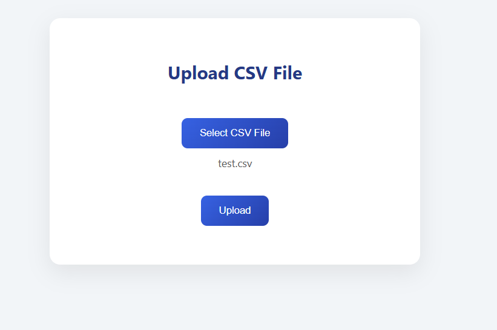
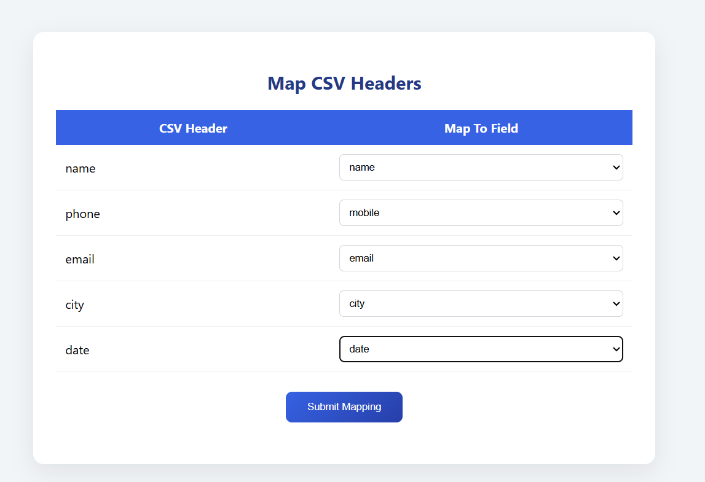
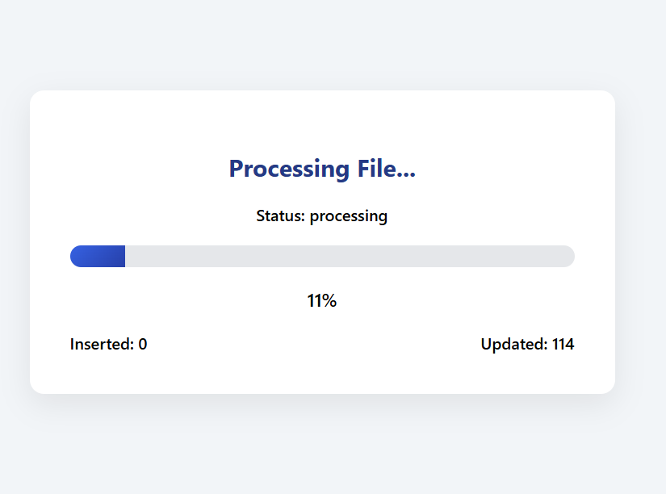
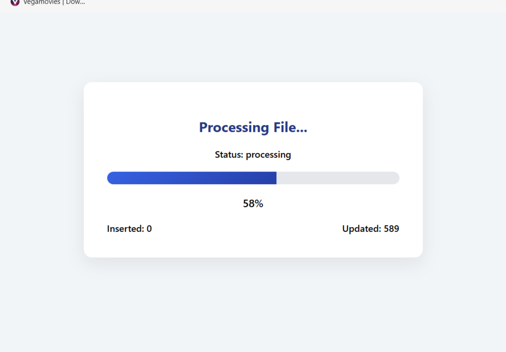
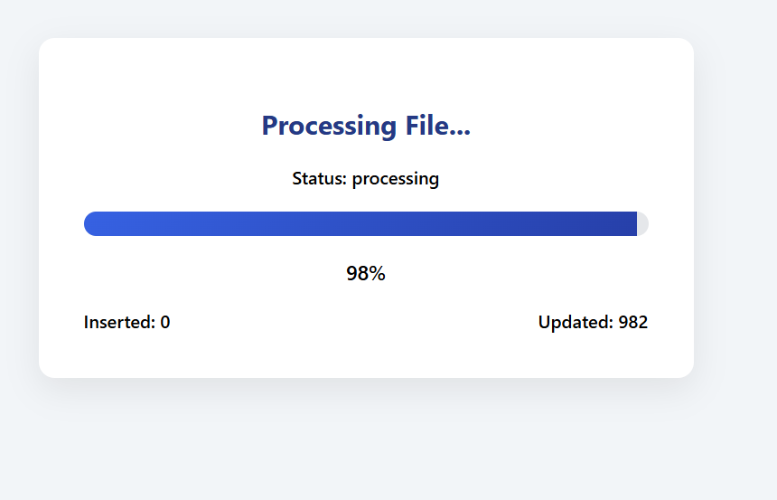
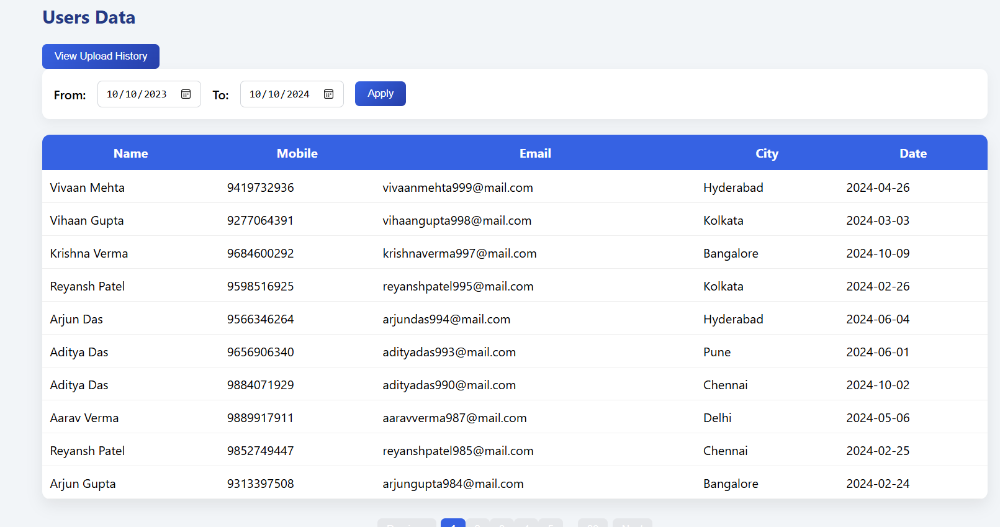
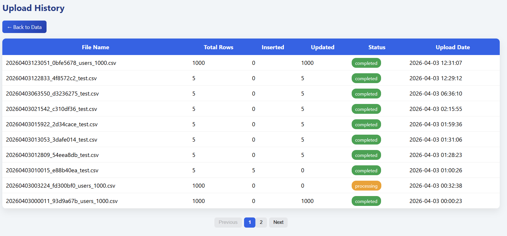
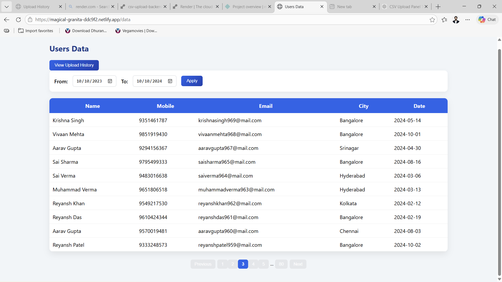
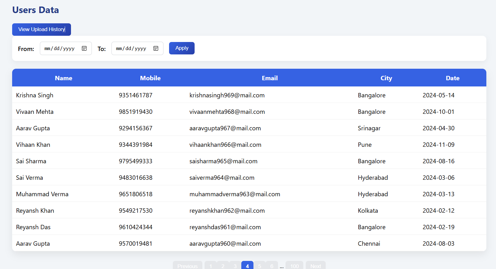

# CSV Upload Panel System

##  Overview
The CSV Upload Panel System is a full-stack web application that allows users to upload CSV files, map headers dynamically, and insert or update records into a database using the mobile number as a unique identifier.

The system provides real-time processing progress, upload history tracking, and date-based filtering.

---

##  Features

- Upload CSV files
- Dynamic header mapping with database fields
- Insert or update records based on mobile number (unique key)
- Real-time processing progress tracking
- View uploaded user data
- Upload history tracking
- Date range filtering
- Pagination support

---

## Tech Stack

### Backend
- Flask (Python)
- SQL Database

### Frontend(Development)
- Django (Primary UI implementation)

### Frontend (Deployed)
- HTML
- CSS
- JavaScript


---
```
## Project Structure

csv-upload-system/
│
├── backend/
│   ├── routes/
│   │   ├── data_routes.py
│   │   ├── main_routes.py
│   │   ├── mapping_routes.py
│   │   ├── process_routes.py
│   │   ├── status_routes.py
│   │   └── upload_routes.py
│   │
│   ├── services/
│   │   └── process_service.py
│   │
│   ├── utils/
│   │   └── db.py
│   │
│   ├── app.py
│   └── requirements.txt
│
├── frontend/
│   ├── app/
│   │   ├── static/css/
│   │   │   ├── data.css
│   │   │   ├── history.css
│   │   │   ├── mapping.css
│   │   │   ├── progress.css
│   │   │   └── upload.css
│   │   │
│   │   ├── templates/
│   │   │   ├── data.html
│   │   │   ├── history.html
│   │   │   ├── mapping.html
│   │   │   ├── progress.html
│   │   │   └── upload.html
│   │   │
│   │   ├── urls.py
│   │   └── views.py
│   │
│   ├── project/
│   │   ├── settings.py
│   │   ├── urls.py
│   │   └── wsgi.py
│   │
│   ├── staticfiles/
│   └── manage.py
│
├── frontend-deploy/
│   ├── css/
│   │   ├── index.css
│   │   ├── data.css
│   │   ├── history.css
│   │   ├── mapping.css
│   │   ├── progress.css
│   │   └── upload.css
│   │
│   ├── index.html
│   ├── upload.html
│   ├── mapping.html
│   ├── progress.html
│   ├── data.html
│   └── history.html
│
├── Screenshots/
│   ├── upload.png
│   ├── headers.png
│   ├── processing1.png
│   ├── processing2.png
│   ├── processing3.png
│   ├── user_data.png
│   ├── history.png
│   ├── filter_date.png
│   └── pagination.png
│
├── .gitignore
└── README.md

```
---

## 🌐 Live Links

- Frontend (Netlify):  
  https://your-netlify-link.netlify.app/

- Backend (Render):  
  https://your-backend-link.onrender.com/

- GitHub Repository:  
  https://github.com/monis-iqbal-io/csv-upload-system

---

## 📸 Screenshots

### Upload Page


### Header Mapping


### Processing Progress




### Data View


### History Page



### Date Filter


### Pagination


---

##  Setup Instructions

### Backend Setup

cd backend
pip install -r requirements.txt
python app.py

---

### Frontend Setup (Static Deployment)

cd frontend-deploy
Open index.html in browser

---

### Django (Primary frontend during development)

### Static HTML/CSS version used for deployment
cd frontend
python manage.py runserver

---

## 📌 Notes

- The frontend was originally built using Django for full-stack integration
- Due to deployment constraints, a static version (frontend-deploy/) was created for hosting on Netlify
- Mobile number is used as a unique identifier for insert/update logic
- Real-time progress tracking is implemented using an in-memory store

---

## 👤 Author

Monis Iqbal
